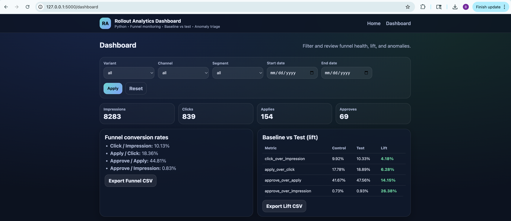
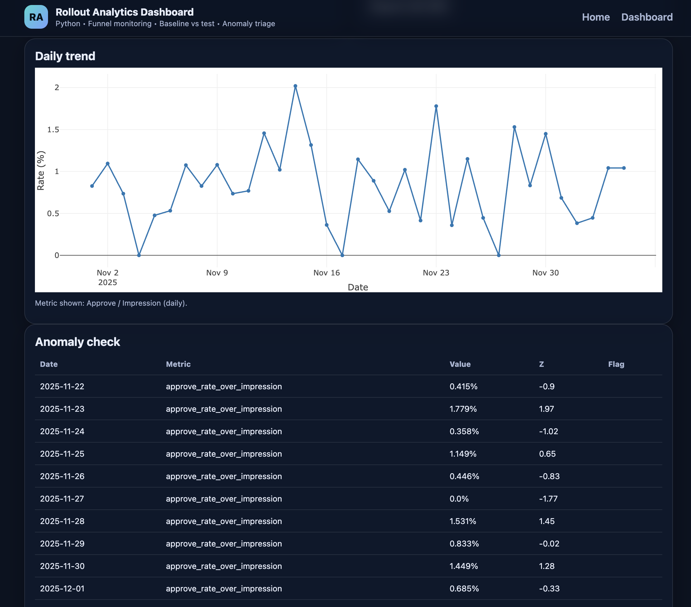

# Rollout Analytics Dashboard (Flask + Python + HTML/CSS)

A modern, recruiter-friendly BA/Data Analyst portfolio project for monitoring rollout performance using funnel metrics, lift, and anomaly triage.

## Screenshots



## What it does
- Upload a CSV (or load included sample data)
- Analyze a conversion funnel: **Impression → Click → Apply → Approve**
- Compare **Control vs Test** (baseline vs rollout) and show lift
- Flag abnormal daily movement with a simple anomaly check (z-score)
- Visualize everything in a clean web dashboard (Plotly embedded in HTML)
- Export reports as CSV (funnel + lift)

## Quick start
```bash
python3 -m venv .venv
source .venv/bin/activate   # macOS/Linux
# .venv\Scripts\activate    # Windows PowerShell

pip install -r requirements.txt
python app.py
Open the local host URL on chrome web browser
Upload the sample csv to use the dashboard